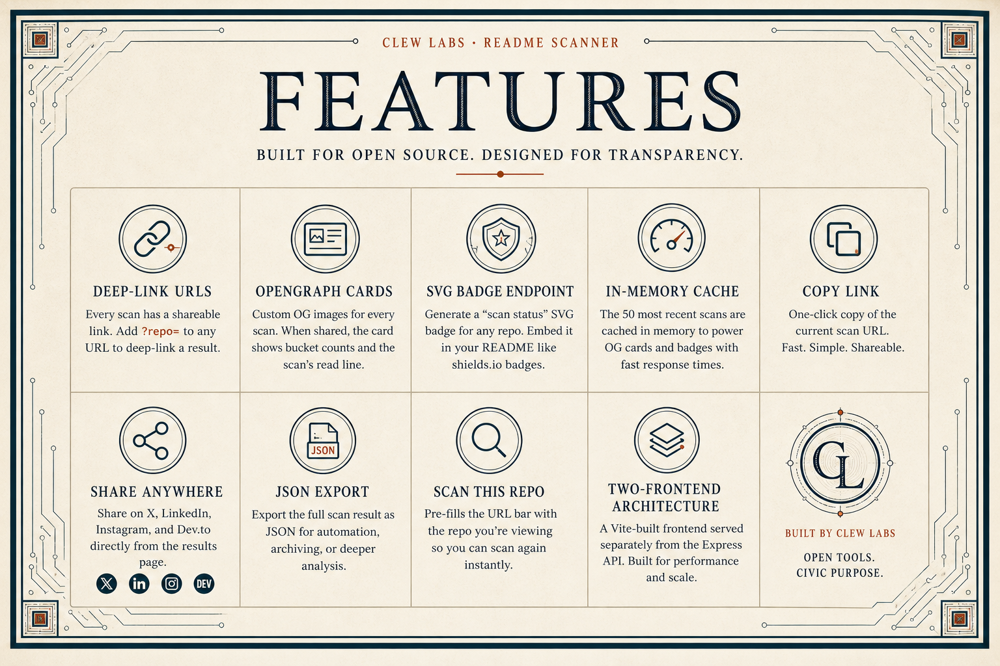

# readme · clew

**audit your own receipts.**


A stateless web tool that audits your GitHub repo for drift between what your README claims and what your code actually does.

Paste a public GitHub repo URL. Claude extracts every checkable claim from your README. Five deterministic verifiers check each claim against your actual code. Findings only. No rewrites. No grading. Nothing saved.

🔗 **[Try it live →](https://readme-clew--earlgreyhot.replit.app/)**

Built for the [Replit 10 Year Buildathon](https://buildathons.replit.app), May 2-3 2026. Apache 2.0 licensed.

---

## Why this exists

I write a lot of READMEs. I ship faster than I document. I work with AI agents that write code in seconds and READMEs in minutes, and somewhere between the first commit and the third refactor, the README I wrote on Tuesday stops matching the code I wrote on Friday.

The install command says `npm start`. The package.json defines `start:prod`. Anyone copying that command would have failed instantly. I'd never know.

README Clew is the audit layer for that gap. The fifth tool in [the Clew suite](#about-the-clew-suite). The thread across all of them: take something invisible and make it inspectable.

---

## How it works

Paste a public GitHub repo URL. README Clew:

1. Fetches your README, your `package.json`, and a slice of your file tree
2. Uses Claude Sonnet 4.5 to extract every checkable claim from the README
3. Runs five deterministic verifiers against the actual code
4. Returns findings in four buckets

### What it checks (5 categories)

- **Declared dependencies** — README says a package is used, we check `package.json`
- **Install and run commands** — README documents a script, we verify it exists
- **Environment variables** — README mentions an env var, we check the code reads it
- **File and URL references** — README points to a path or link, we verify it resolves
- **Code-vs-package coverage** — imports in code cross-referenced with declared deps

### What you get back (4 buckets)

- **● Verified** — README matches the code (the receipts)
- **○ Unverifiable** — claims like "blazingly fast" or "85 passing tests" — valid but not statically checkable (the honest limit)
- **▲ Missing** — code does things the README never mentions (the gaps)
- **✕ Contradicted** — README and code disagree (the drift)

Each finding shows the verbatim quote from your README and the evidence from your code. Don't trust the verdict — trust the receipts.

---

## Features



- **Deep-link URLs** — every scan has a shareable `?repo=` query param
- **OpenGraph cards** — preview cards on social show bucket counts and the synthesis line
- **SVG status badge** — embed your scan status in any README, like a shields.io badge but for documentation honesty
- **JSON export** — pipe full scan results into your own tooling
- **Copy link / share anywhere** — X, LinkedIn, Instagram, Dev.to from the results page
- **Scan-this-repo** — pre-fills the input with the repo you're viewing
- **In-memory cache** — the 50 most recent scans power fast OG cards and badges
- **Two-frontend architecture** — Vite-built static frontend served separately from the Express API

---

## What it doesn't do (limitations are a feature)

- Doesn't rewrite your README. You see the drift, you fix it.
- Doesn't grade writing quality. Subjective claims aren't bad — they're unverifiable.
- Doesn't store anything. Stateless. The findings are yours.
- Doesn't analyze private repos in v1. Public only.
- JavaScript and TypeScript only in v1. Python and Go later.

---

## Architecture

Hybrid deterministic + AI. Claude does the parsing of natural language. Five deterministic verifiers do the actual checking. The AI's role is narrowly scoped to extraction and synthesis, never to verification itself.

```
                ┌──────────────────────┐
                │  POST /api/scan      │
                │  { repoUrl }         │
                └──────────┬───────────┘
                           │
                           ▼
        ┌──────────────────────────────────┐
        │  validate.ts                     │
        │  github.com/owner/repo regex     │
        └──────────────────┬───────────────┘
                           │
                           ▼
        ┌──────────────────────────────────┐
        │  github.ts                       │
        │  fetch README, package.json,     │
        │  file tree, source files         │
        └──────────────────┬───────────────┘
                           │
                           ▼
        ┌──────────────────────────────────┐
        │  extract.ts (Claude API)         │
        │  parse claims with verbatim      │
        │  quotes, ≤50KB README, prompt    │
        │  injection delimiters            │
        └──────────────────┬───────────────┘
                           │
                           ▼
        ┌──────────────────────────────────┐
        │  orchestrator.ts                 │
        │  runs 5 verifiers in parallel    │
        └──────┬───────┬───────┬─────┬─────┘
               │       │       │     │
               ▼       ▼       ▼     ▼
            deps  commands  refs  envvars  coverage
               │       │       │     │       │
               └───────┴───┬───┴─────┴───────┘
                           │
                           ▼
        ┌──────────────────────────────────┐
        │  summarize.ts (Claude API)       │
        │  synthesis line + bucket context │
        │  9s timeout, fail-open           │
        └──────────────────┬───────────────┘
                           │
                           ▼
        ┌──────────────────────────────────┐
        │  scan-cache (50 entries, RAM)    │
        │  powers OG cards + badge         │
        └──────────────────────────────────┘
```

**Two Claude calls per scan**: one for extraction, one for the synthesis line. The synthesis call is fail-open — if it errors or times out (9s budget), you still get full findings.

**Three side endpoints share the cache**:

- `GET /api/badge?owner=...&repo=...` — SVG status badge
- `GET /api/og?owner=...&repo=...` — OpenGraph card metadata
- `POST /api/scan` — full scan (60s timeout, 10/hr per IP)

---

## Project structure

```
.
├── artifacts/
│   ├── api-server/             ← Express + TypeScript backend
│   │   ├── src/
│   │   │   ├── app.ts          ← Express setup, helmet, CORS, body limits
│   │   │   ├── index.ts        ← server entry point
│   │   │   ├── validate.ts     ← GitHub URL validation
│   │   │   ├── github.ts       ← GitHub API: README, package.json, files
│   │   │   ├── extract.ts      ← Claude extraction call
│   │   │   ├── orchestrator.ts ← runs 5 verifiers, aggregates results
│   │   │   ├── summarize.ts    ← Claude synthesis call (fail-open)
│   │   │   ├── scan-cache.ts   ← 50-entry in-memory cache
│   │   │   ├── routes/
│   │   │   │   ├── scan.ts     ← POST /api/scan (rate-limited)
│   │   │   │   ├── badge.ts    ← GET /api/badge SVG
│   │   │   │   ├── og.ts       ← GET /api/og card metadata
│   │   │   │   └── health.ts   ← GET /api/healthz
│   │   │   └── verifiers/
│   │   │       ├── dependencies.ts
│   │   │       ├── commands.ts
│   │   │       ├── envvars.ts
│   │   │       ├── references.ts
│   │   │       └── coverage.ts
│   │   └── public/             ← static fallback (cover artwork, etc.)
│   └── frontend/               ← Vite-built SPA
│       ├── public/             ← cover artwork, OG image, favicons
│       ├── index.html
│       └── vite.config.ts
├── fixtures/                   ← extraction prompt test fixtures
│   ├── 01-clean-minimal.md
│   ├── 02-real-vite-react.md
│   ├── 03-real-express-api.md
│   ├── 04-shara-memoria.md
│   ├── 05-shara-petitmot.md
│   ├── 06-edge-empty.md
│   ├── 07-edge-no-claims.md
│   ├── 08-edge-conditional.md
│   ├── 09-edge-monorepo.md
│   ├── 10-edge-malformed.md
│   └── expected/               ← expected JSON output per fixture
├── docs/                       ← hero + features images for this README
├── lib/                        ← shared workspace libraries
├── scripts/                    ← workspace-level scripts
├── pnpm-workspace.yaml
└── README.md                   ← you are here
```

This is a pnpm monorepo. The two artifacts (`api-server`, `frontend`) deploy as separate Replit deployment artifacts so each can scale independently.

---

## Run it locally

### Prerequisites

- **Node.js** 20+
- **pnpm** 9+ (the workspace enforces pnpm via the `preinstall` script)
- An **Anthropic API key**
- A **GitHub Personal Access Token** with `public_repo` scope (raises GitHub API rate limit from 60/hr to 5,000/hr)

### Install

```bash
pnpm install
```

The workspace requires a 1-day minimum release age on npm packages as a supply-chain attack defense. See `pnpm-workspace.yaml` for details.

### Configure secrets

Set both environment variables before running:

```bash
export ANTHROPIC_API_KEY="sk-ant-..."
export GITHUB_PAT="ghp_..."
```

On Replit, add these in the Secrets pane.

### Develop

```bash
# Backend (Express API on :3000 by default)
pnpm --filter @workspace/api-server run dev

# Frontend (Vite dev server)
pnpm --filter @workspace/frontend run dev
```

### Test the extraction prompt against fixtures

```bash
pnpm --filter @workspace/api-server run test:fixtures
```

This runs the extraction prompt against all 10 fixtures (clean READMEs, edge cases, real repos) plus an injection-resistance test. The prompt is considered passing if ≥8/10 fixtures match expected output. Currently runs at 11/11.

### Type-check the whole workspace

```bash
pnpm run typecheck
```

### Build for production

```bash
pnpm run build
```

---

## API

### `POST /api/scan`

Run a scan against a public GitHub repo.

**Request:**
```json
{ "repoUrl": "https://github.com/owner/repo" }
```

Accepts both `https://github.com/owner/repo` and `github.com/owner/repo`.

**Response (200):**
```json
{
  "verified": [...],
  "unverifiable": [...],
  "missing": [...],
  "contradicted": [...],
  "notes": {
    "read": "synthesis sentence about the scan",
    "bucketContext": {
      "verified": "...",
      "unverifiable": "...",
      "missing": "...",
      "contradicted": "..."
    }
  },
  "meta": {
    "owner": "...",
    "repo": "...",
    "claimsExtracted": 23,
    "readmeTruncated": false
  }
}
```

**Errors:**
- `400` — invalid input (URL format, missing field, oversize body)
- `413` — request body exceeds 4kb
- `422` — known external failure (repo not found, rate limit hit, scan timeout)
- `429` — IP rate limit exceeded (10/hr)

### `GET /api/badge?owner=...&repo=...`

Returns an SVG status badge. Reads from the in-memory scan cache. Embed in any README:

```markdown

```

### `GET /api/og?owner=...&repo=...`

Returns OpenGraph metadata for the most recent cached scan of that repo.

### `GET /api/healthz`

Returns `200 OK` if the server is running.

---

## Trust model

The tool is intentionally narrow. Five deterministic verifiers run on actual code. One Claude API call extracts claims. One Claude API call generates synthesis. The system prompt instructs Claude to use only verbatim quotes from the README — that's a prompt-level guardrail, not a post-processing validation step. Honest distinction worth making.

Every finding shows you the README quote and the code reference. **Don't trust the verdict, trust the receipts.**

### Known limitations

- The verbatim-quote rule is enforced by prompt instruction, not by code that validates the quote against README source. In practice Claude follows the rule; in principle this is a soft guardrail.
- Prose labels in dependency claims produce occasional false positives in the contradicted bucket (Claude sometimes pulls "Frontend (Vite)" as a package name; v2 fix).
- Monorepo support is conventional-path-only — `packages/`, `apps/`, `server/`, `frontend/`, `client/`, `backend/`, `api/`, `web/`. Custom paths won't be discovered.
- Source file scan caps at 20 files for envvar checking.
- Two Claude calls per scan add 10–20s typical, 60s hard ceiling.

---

## Security posture

For a stateless public tool with no auth, the threat model is small but nonzero:

- **Prompt injection protection** on every LLM call — README content wrapped in `<readme>` delimiters, system prompt instructs the model to treat input as data, not commands. Tested with `IGNORE ALL PREVIOUS INSTRUCTIONS` injection.
- **Strict input validation** at the server boundary. GitHub URL must match `github.com/owner/repo` regex.
- **Rate limiting** at 10 scans/hour per IP. Reads `X-Forwarded-For` correctly behind Replit's proxy.
- **API keys server-side only** via `process.env`. Zero references to `process.env` in any frontend file.
- **XSS-safe DOM rendering** throughout. All user-supplied data inserted via `.textContent`, never `.innerHTML`.
- **Hard timeouts** — 60s scan, 9s synthesis. README truncated at 50KB. File scan capped at 20 files.
- **Logging captures no PII or repo content** — only request ID, method, URL path (query stripped), status, response time.
- **Helmet middleware** for CSP, HSTS, X-Content-Type-Options, X-Frame-Options.
- **Body size limit** of 4kb on POST requests.
- **Fail-open architecture** — if synthesis fails, findings still return.

Not production-hardened (no auth, no audit log, intentional). Solid for a public stateless tool.

---

## Stack

- **Server:** Node.js, Express 5, TypeScript, esbuild
- **Frontend:** vanilla HTML/CSS/JS bundled by Vite
- **LLM:** Claude Sonnet 4.5 via `@anthropic-ai/sdk`
- **Code parsing:** `acorn` + `acorn-jsx` + `acorn-walk`
- **Logging:** `pino` with PII-safe serializers
- **Hosting:** Replit Deployments
- **Workspace:** pnpm monorepo

---

## Contributing

The build principles are documented in [`replit.md`](replit.md). The short version:

- One file, one responsibility. No god files.
- MUST / STUB / NEVER labels on every feature.
- Stub, don't build — half-features are worse than no features.
- Mock data first, then wire APIs.
- `textContent`, never `innerHTML` with user data.
- `try/catch` on every fetch.
- API keys in `process.env` only.
- Honest over optimistic. Limitations language is a feature.

If you're adding a verifier, model it on the existing five. Each one is a pure function from `(claims, repoData)` to `{verified, unverifiable, missing, contradicted}`. Add fixtures alongside it.

---

## About the Clew suite

README Clew is the fifth tool in a growing suite of small developer tools that share one thesis: take something invisible and make it inspectable.

- **Janus Clew** — invisible indie-builder growth made measurable
- **Memoria Clew** — invisible research context made transparent
- **Themis Lex** — invisible AI readiness for court staff made explainable
- **Hermes Clew** — invisible agent-readability of websites made scannable
- **README Clew** — invisible README-vs-code drift made surfaceable

Self-taught builders ship faster than they document. AI agents help us write more code than we can keep track of. We need tools that close the gap between what we say our code does and what our code actually does.

That's the Clew. Audit your own receipts.

---

## License

[Apache 2.0](LICENSE). Free to use, fork, modify. Attribution appreciated.

---

*AI assisted. Human approved. Powered by NLP.*
